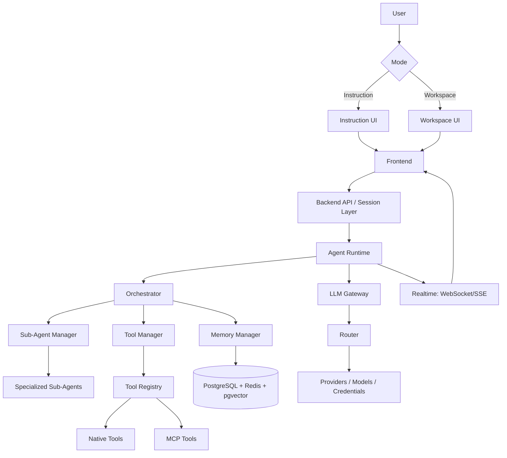

# 01 — System Architecture

Source of truth: Phase 1 (`planning/`). This document defines the complete component map and communication boundaries. No implementation.

## Tiers (locked)

| Tier | Components | Technology |
|------|-----------|------------|
| FRONTEND | Instruction UI, Workspace UI, shared client state | Next.js, React, TypeScript, Tailwind CSS, shadcn/ui, Zustand, Framer Motion |
| BACKEND | API/Session layer, Agent Runtime host, Orchestrator host, Realtime gateway | Python, FastAPI, asyncio |
| AGENT CORE | Main Agent, Planner, Executor, Verifier, Sub-Agent Manager, Tool Manager, Memory Manager, Orchestrator, LLM Gateway | Custom (no external agent framework) |
| INFRASTRUCTURE | Persistence, cache, vector store, browser | PostgreSQL, Redis, pgvector (optional), Playwright |
| EXTERNAL | LLM providers, MCP servers, web/search/browser services | Provider APIs, MCP stdio/HTTP |

## End-to-end flow

## Component responsibilities (summary)
- **Frontend:** render Instruction/Workspace UX, send requests, display task/agent/tool activity and results, collect approvals.
- **Backend API / Session Layer:** authenticate, authorize, create conversations/tasks, expose execution + workspace operations, bridge to realtime.
- **Agent Runtime:** own the task lifecycle; contains Main Agent, Planner, Executor, Verifier, and the three managers.
- **Orchestrator:** central execution controller; decomposes, selects, orders, parallelizes, verifies, retries, fixes, replans (see 03-orchestrator.md).
- **Sub-Agent Manager:** lifecycle of specialized sub-agents under Orchestrator control.
- **Tool Manager:** registry + permission-gated execution of native and MCP tools.
- **Memory Manager:** conversation/task/execution context + persistent memory.
- **LLM Gateway:** provider/model abstraction; Router selects eligible credential/profile.
- **Infrastructure:** durable + transient state and browser automation.

## Communication rules (no architecture drift)
- Agents reach models **only** via LLM Gateway (never direct provider calls).
- Agents reach tools **only** via Tool Manager (never direct host execution bypassing permission check).
- Sub-agents are invoked **only** by the Orchestrator (never autonomous).
- Frontend reaches the core **only** via Backend API / Session Layer + Realtime (never direct runtime calls).
- UI sees only task/agent/tool/event state exposed by the API; internal reasoning, raw credentials, and full tool payloads stay internal (see 15-security-and-permissions.md).

## External provider boundary
External providers are accessed exclusively through the LLM Gateway. Provider terms, quotas, and rate limits are enforced in the Gateway; no bypassing (07-llm-gateway-and-router.md).
