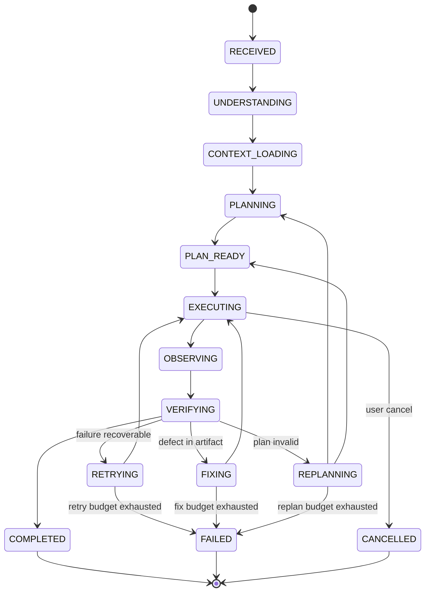

# 02 — Agent Runtime

Defines the Agent Runtime internal architecture and the task lifecycle state machine. Source of truth: Phase 1 `03-agent-runtime.md` and `02-architecture.md`. No implementation.

## Components (locked from Phase 1 §5)

| Component | Responsibility | Owns state |
|-----------|---------------|-----------|
| Main Agent | General-purpose entry; understands the request, decides autonomous vs user-guided flow, hands to Planner/Orchestrator | current conversation intent |
| Planner | Decomposes goals into a Plan of Steps with dependencies | draft plan |
| Orchestrator | Central execution controller (see 03-orchestrator.md) | execution graph, step states |
| Executor | Runs a single Step via a selected sub-agent/tool/model | step execution record |
| Verifier | Checks generated output against verification requirement | verification verdict |
| Sub-Agent Manager | Creates/selects/monitors/evaluates sub-agents under Orchestrator | sub-agent execution records |
| Tool Manager | Registers tools, performs permission check, executes, normalizes results | tool execution records |
| Memory Manager | Assembles/compresses/retrieves context; persists memory | context window + persistent memory |

## Lifecycle state machine (derived from locked flow in spec §2)

## State definitions
- **RECEIVED:** raw user request accepted by API; task record created.
- **UNDERSTANDING:** Main Agent classifies intent, mode, and constraints.
- **CONTEXT_LOADING:** Memory Manager assembles conversation/task/retrieval context.
- **PLANNING:** Planner produces a Plan; Orchestrator validates dependencies.
- **PLAN_READY:** plan accepted (or approved by user if required).
- **EXECUTING:** Orchestrator drives Steps via Executor/Sub-Agent Manager/Tool Manager.
- **OBSERVING:** outputs/events captured after a Step.
- **VERIFYING:** Verifier evaluates against verification requirement.
- **COMPLETED / FAILED / CANCELLED / RETRYING / FIXING / REPLANNING:** as diagram.

## Data in / out per component
- Main Agent: in = request + context; out = intent + constraints.
- Planner: in = intent + context; out = Plan (Steps, deps).
- Orchestrator: in = Plan + context; out = step dispatch + aggregated result.
- Executor: in = Step + assigned agent/tool/model; out = step result/error.
- Verifier: in = artifact + verification requirement; out = verdict (accept/diagnose).
- Sub-Agent Manager: in = delegation spec; out = sub-agent result/error.
- Tool Manager: in = tool call + permission context; out = normalized result/error.
- Memory Manager: in = writes (results, memory) + queries; out = assembled context block.

## Invariants
- Runtime remains provider-agnostic (all model access via LLM Gateway).
- Sub-agents never spawn other sub-agents autonomously; only the Orchestrator delegates.
- Every external side effect goes through Tool Manager permission check.
