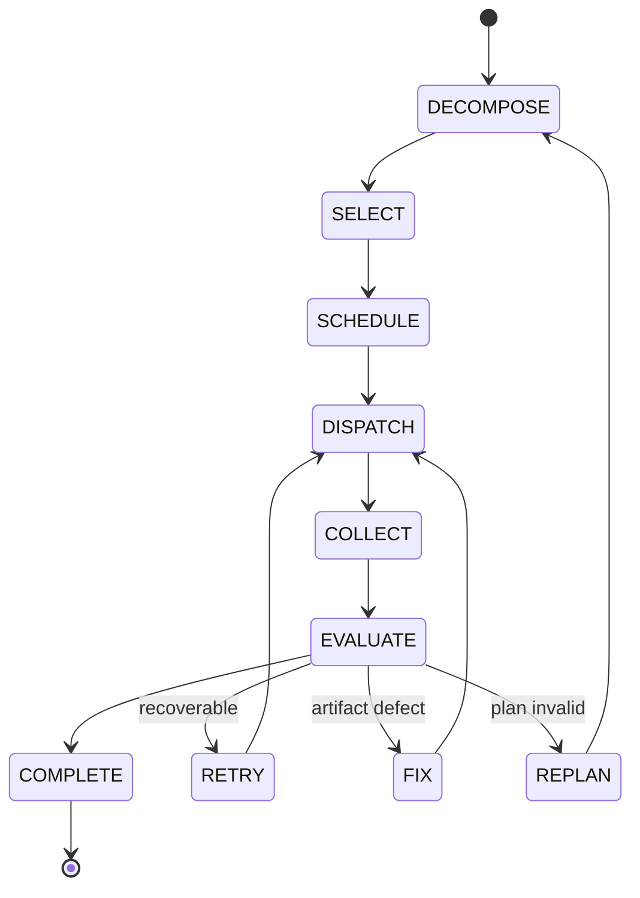

# 03 — Orchestrator

This is the central execution controller. Source of truth: Phase 1 `04-orchestration.md` and spec §6. No implementation.

## Entry
A task enters the Orchestrator as a **Task Intent** after the Main Agent's UNDERSTANDING/CONTEXT_LOADING steps:

```
TaskIntent = {
  goal, mode, constraints[], context_refs[],
  user_specified { sub_agent?, model?, tool?, order?, first_step?, avoid[] }
}
```

## Responsibilities (locked, spec §6)
- task decomposition
- execution plan construction
- sub-agent selection
- tool selection
- model selection
- execution order determination
- sequential vs parallel decision
- dependency handling
- verification points placement
- retry / fix / re-plan strategy
- progress monitoring and evaluation

## Orchestration state machine



## Step detail

### DECOMPOSE
- Input: TaskIntent + assembled context.
- Output: a Plan of Steps. Each Step carries: id, goal fragment, expected output, verification requirement, dependencies[], candidate sub-agent category, candidate tool categories, candidate model requirement.
- Dependency representation: directed edges `Step A -> Step B` meaning B waits for A's result.

### SELECT
- **Sub-agent selection:** match Step role to a specialized sub-agent category (05-sub-agent-system.md). Override with `user_specified.sub_agent` when valid.
- **Tool selection:** match Step need to Tool Registry categories (06-tool-and-mcp-system.md). Override with `user_specified.tool`.
- **Model selection:** translate Step `model_requirement` (capability, not provider) into an LLM Gateway request; Router chooses provider/credential (07-llm-gateway-and-router.md). Override with `user_specified.model`.

### SCHEDULE
- Build an execution order honoring dependencies.
- **Parallel allowed** when Steps have no unresolved dependency edge between them and share no exclusive resource (e.g., same file write) — see 04-task-planning-and-execution.md.
- **Sequential required** when a dependency edge exists or a Step consumes a prior Step's output.

### DISPATCH
- For each ready Step: Orchestrator calls Sub-Agent Manager (delegation) and/or Tool Manager (tool call) with permission context. Sub-agents are NEVER invoked directly by other sub-agents.

### COLLECT
- Aggregate sub-agent/tool outputs into partial results keyed by Step id. Partial results persist (09-task-state-and-events.md) so a later retry/replan resumes from preserved state.

### EVALUATE
- Run verification at each Step's verification point (10-verification-and-recovery.md).
- On accept → proceed / COMPLETE.
- On recoverable failure → RETRY (within budget).
- On artifact defect → FIX (re-run producing step with correction).
- On invalid plan / new information → REPLAN.

## AUTONOMOUS DECISION vs USER-SPECIFIED INSTRUCTION
- **Autonomous:** Orchestrator derives all selections from intent + context + policies.
- **User-specified:** `user_specified` fields become hard constraints applied during SELECT/SCHEDULE. Example: "use Research Agent first" sets `first_step`/`order` and pins that Step's sub-agent. "use this model" pins `model_requirement` for the affected Step(s).
- User guidance never overrides permission/security constraints (15-security-and-permissions.md). Invalid user constraints are rejected with a reason instead of silently ignored.

## Completion
Task is COMPLETE when all Steps are verified-accepted and the aggregated result satisfies the goal's completion criteria. The final result is returned via the API/Realtime layer to the UI.

