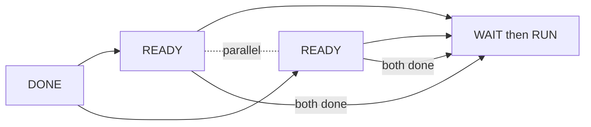

# 04 — Task Planning and Execution

Defines the planning data model and concurrent execution rules. Source of truth: Phase 1 `04-orchestration.md` §17 (parallelism) and spec §2. No implementation.

## Planning data model

```
Task
  id, conversation_id, user, mode
  goal
  constraints[]
  context_refs[]          # memory/retrieval handles
  user_specified{}        # orchestrator constraints
  plan: Plan

Plan
  steps: Step[]
  edges: Dependency[]      # StepA -> StepB

Step
  id
  goal_fragment
  expected_output
  verification_requirement
  dependencies: StepId[]
  sub_agent_category?      # selected/overridden
  tool_categories[]        # selected/overridden
  model_requirement?       # capability, not provider
  status                   # PENDING|READY|RUNNING|DONE|FAILED
  result_ref?

Dependency
  from_step, to_step       # to_step waits for from_step.result
```

## How execution moves between steps
1. A Step is **READY** when all its `dependencies` are DONE.
2. Orchestrator dispatches READY steps (03-orchestrator.md SCHEDULE/DISPATCH).
3. On Step DONE, dependents recompute readiness; newly READY steps are dispatched.
4. Process ends when all Steps DONE (COMPLETE) or a terminal failure occurs.

## Parallel vs sequential



- **Parallel:** S2 and S3 have no dependency between them and no conflicting exclusive resource (e.g., both writing the same file). They execute concurrently; results join at S4.
- **Sequential:** any dependency edge forces ordering. A Step consuming another's `result_ref` cannot start until that result exists.

## Partial result preservation
- Each Step writes its output to Task State (09-task-state-and-events.md) keyed by `result_ref`.
- On RETRY/FIX/REPLAN, already-DONE independent steps are NOT recomputed; only affected steps re-execute.
- This makes long tasks recoverable and avoids redundant work.

## Completion criteria
A Task is complete when every Step is DONE and verified-accepted, and the aggregated outputs satisfy the Task `goal` completion criteria defined at PLAN_READY.
