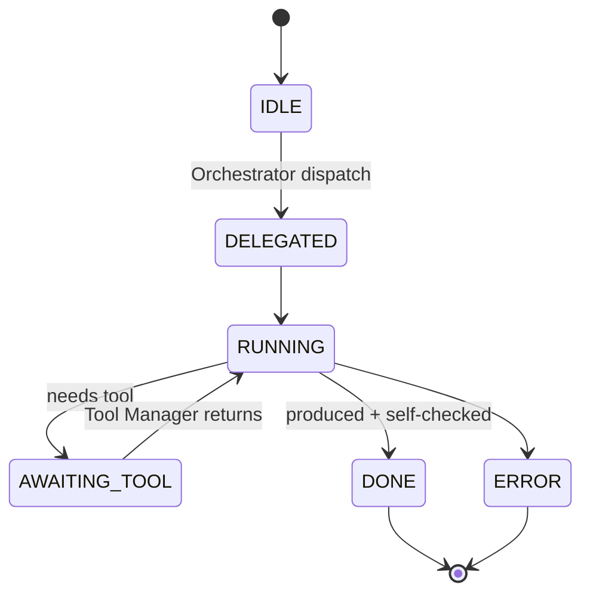

# 05 — Sub-Agent System

Defines the runtime architecture for specialized sub-agents. Source of truth: Phase 1 `05-sub-agent-architecture.md` and spec §7, §8. No implementation.

## CRITICAL DISTINCTION
- **PRODUCT RUNTIME SUB-AGENTS:** the 14 specialized agents below. They are part of the shipped platform, owned and invoked by the Orchestrator via the Sub-Agent Manager. Their lifecycle, permissions, and tool access are defined here.
- **OPENCODE DEVELOPMENT-TIME SUB-AGENTS:** the `.opencode/agent/*.md` files in this repo (research-agent, coding-agent, etc.). These are a development aid for building/maintaining the project. They are NOT the product runtime sub-agents and must NOT be assumed to be the final runtime architecture. The runtime sub-agents are specified independently below and implemented in Phase 3.

## Lifecycle (all runtime sub-agents)

Sub-agents never transition to DELEGATED on their own; only the Orchestrator initiates.

## Per-category specification

| Category | Purpose | Input | Output | Allowed tool categories | Failure behavior |
|----------|---------|-------|--------|------------------------|------------------|
| Research | Investigate libs/APIs/docs | query, context | research brief + sources | Web, Search | report gap; do not guess |
| Deep Reading / Understanding | Contextual comprehension of sources | documents, context | structured understanding | Files, Web | report ambiguity |
| Analysis | Analyze requirements/design/trade-offs | subject, context | analysis + recommendation | Files, Calculator | report contradiction |
| Planning | Decompose goals | intent, context | Plan draft | Files | hand back; no execute |
| Coding | Implement per spec | task, context | code + notes | Code, Terminal, Files | report blocker; no silent redesign |
| Writing | Author docs/specs/copy | outline, context | document | Files | report missing input |
| Debug | Diagnose failures | symptom, logs | root-cause analysis | Code, Terminal, LSP | hand to Fix |
| Fix | Apply targeted fix | diagnosis | patched change | Code, Terminal, Files | report if blocked |
| Review | Review code/design/spec | target | findings by severity | Files, Code | hand to Fix |
| Testing | Author/run tests | target | pass/fail + coverage | Terminal, Code | report failures |
| Browser | Web automation/scrape/verify | URL, action | extracted state | Browser, Web | report blocked |
| File | Locate/read/organize files | pattern, context | file context bundle | Files | fall back to search |
| Verification | Verify artifacts vs requirement | artifact, requirement | verdict (accept/diagnose) | Files, Tool result refs | escalate to Orchestrator |
| Security / Permission | Audit security/permissions | target | findings by severity | Files, Code | hand to Fix; never expose secrets |

## Common contract (every runtime sub-agent)
- **Expected context:** task fragment, relevant memory, prior step results, permission scope.
- **Relationship with Orchestrator:** invoked only by Orchestrator; returns result or structured error; may request Tool Manager calls (mediated, permission-checked).
- **Verification responsibility:** each sub-agent self-checks its own output before returning; final acceptance is the Verifier's (10-verification-and-recovery.md).
- **Failure behavior:** return a typed error (classifiable per 10) — never silently partial-success.

## Notes
Per-sub-agent runtime implementation contracts are RESOLVED in Phase 2.1 as the **common SubAgentContract** in `decisions/04-sub-agent-contract-decision.md` (responsibility, selection triggers, input/output schemas, status/failure reporting, verification, handoff, and orchestrator interactions).
