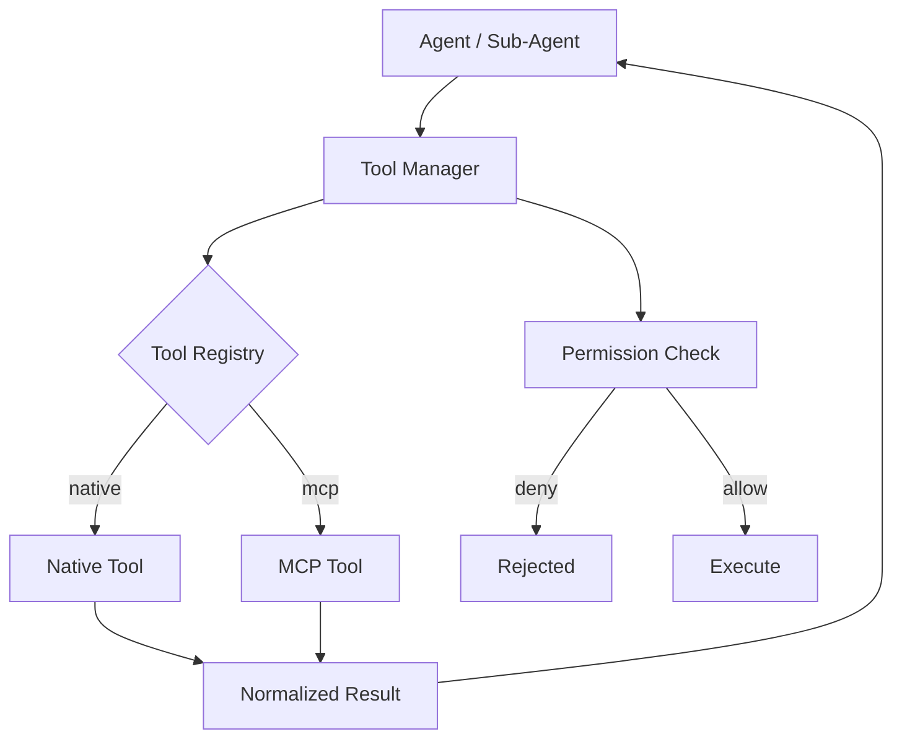

# 06 — Tool and MCP System

Defines the tool architecture and the MCP boundary. Source of truth: Phase 1 `06-tool-architecture.md` and spec §11. No implementation.

## Categories (locked, spec §11)
Web, Search, Files, Code, Terminal, Browser, Calculator, Custom Tools.

## Tool Registry
Central registry owned by the Tool Manager. Each entry:

```
Tool
  name
  description
  category
  input_schema            # JSON Schema
  output_schema           # JSON Schema
  permission_requirements # action + scope
  execution_mechanism     # native | mcp
  timeout_ms
  error_policy
```

## Tool Interface (contract every tool satisfies)
1. Validate input against `input_schema`.
2. Perform `permission_requirements` check via Permission layer (15-security-and-permissions.md).
3. Execute via `execution_mechanism`.
4. On success: normalize output to `output_schema`.
5. On failure: return typed error (timeout / denied / invalid_result / execution_error).
6. Record execution in Task State (tool_executions).

## Execution flow



MCP is **NOT** mandatory for every tool. Native application tools (e.g., internal Calculator, Files) run in-process; MCP is used for tools that are naturally external (e.g., Playwright browser, external services).

## Boundaries
- **Native application tools:** implemented inside the backend; direct, permission-gated.
- **MCP tools:** exposed by an MCP server (stdio/HTTP); invoked through the MCP client inside Tool Manager; same normalized interface.
- **External services:** reached only through a Tool (native or MCP); never called directly by agents.

## Relation to OpenCode MCP config
The current `.opencode/mcp.json` (context7, code-intelligence, graphify) is a **development-time** aid for building this project. It is NOT automatically the product runtime MCP layer. The product runtime MCP integration is defined here: the Tool Manager includes an MCP client that connects to configured product MCP servers at runtime, distinct from the developer's editor MCP setup. Phase 3 decides which product MCP servers exist.

## Error handling
- Timeout → typed `TIMEOUT` error; Orchestrator may retry per 10-verification-and-recovery.md.
- Permission deny → `DENIED`; surfaces as an approval request to the user if policy allows.
- Invalid result → `INVALID_RESULT`; triggers verification failure path.
