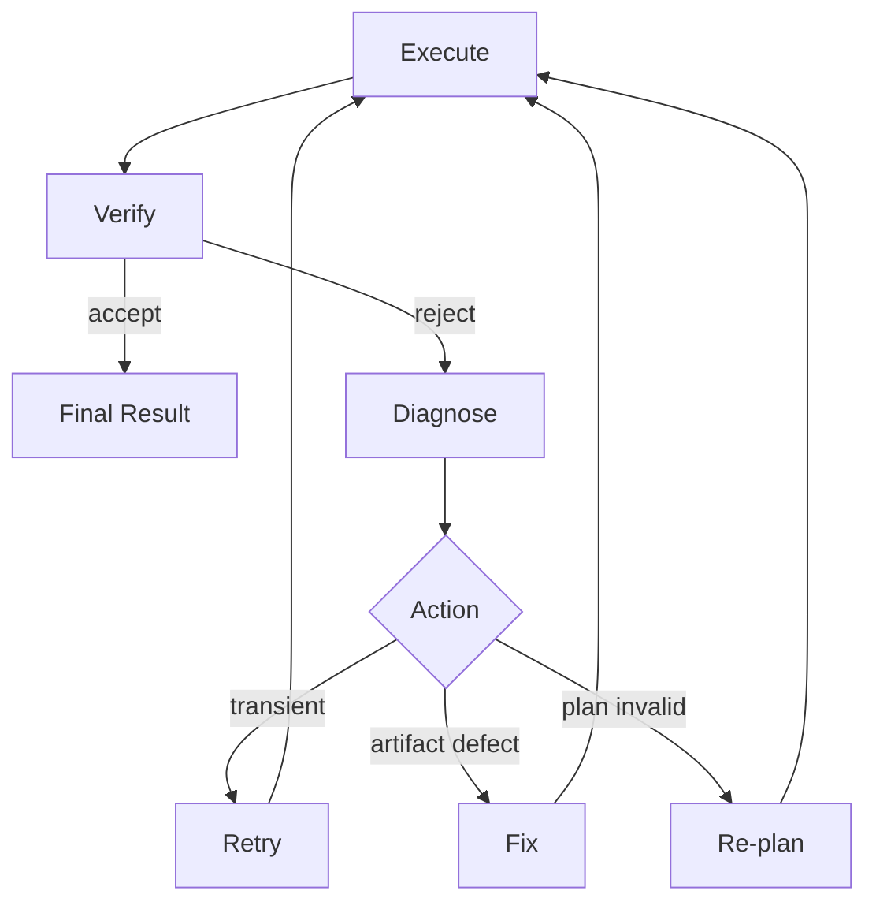

# 10 — Verification and Recovery

Defines the quality-control and failure-handling architecture. Source of truth: Phase 1 `13-testing-strategy.md` and spec §15, §16. No implementation.

## Loop

## Verification triggers
- After every Step that has a `verification_requirement` (set at PLAN_READY).
- Before task COMPLETE (aggregate verification of all steps).

## Verification responsibility
- Each sub-agent self-checks its output (05).
- The Verifier makes the authoritative accept/reject decision using the Step's `verification_requirement`.

## Failure classification
| Class | Meaning | Path |
|-------|---------|------|
| TRANSIENT | timeout, 429, network blip | RETRY |
| ARTIFACT_DEFECT | wrong/incomplete output | FIX |
| PLAN_INVALID | approach wrong / new info | REPLAN |
| TERMINAL | unrecoverable (e.g., missing dependency, policy block) | TASK_FAILED |

## Limits (no infinite loops)
- Retry budget: max N retry attempts per step (N defined in Phase 3 config; architecturally bounded).
- Fix budget: max M fix cycles per step.
- Replan budget: max K replan cycles per task.
- On exhausting a budget → terminal failure with a clear reason (no silent loop).

## Recovery actions
- **Retry:** re-execute same step (may hit Fallback in Gateway, 07).
- **Fix:** re-run producing step with the diagnosis injected as correction context.
- **Re-plan:** Orchestrator returns to DECOMPOSE with new information; preserves DONE steps' results.

## What depends on it
Concrete per-artifact verification strategies are RESOLVED in Phase 2.1 as **per-category verification methods** in `decisions/03-verification-decision.md`; this document defines the mechanism and boundaries, and decision 03 defines the exact methods per category.
