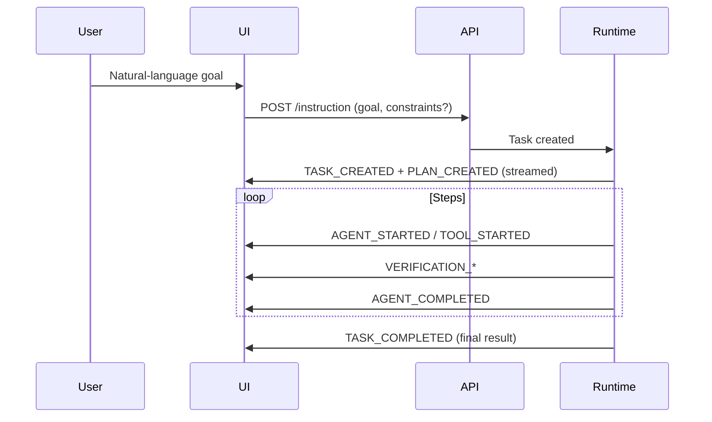

# 11 — Instruction Mode

Defines Instruction Mode as its own UX + system interaction model. Source of truth: Phase 1 `10-ui-modes.md` and spec §3. No implementation. NOT a chatbot.

## Principle
The user gives a natural-language goal. The system may understand, plan, orchestrate, delegate, execute, verify, recover, and return a result. The user does not manually build the workflow.

## Interaction flow

## UX surfaces (architectural, not visual)
- **Request submission:** single goal input + optional constraints.
- **Progress visibility:** task state, current step, percentage/status.
- **Plan visibility:** the Plan (steps + dependencies) shown after PLAN_CREATED; user may approve if policy requires.
- **Agent activity visibility:** which sub-agent is running, for which step.
- **Tool activity visibility:** which tool/category is running, status.
- **Result presentation:** final result + per-step summaries.
- **Approval/permission interactions:** when a tool/action needs approval, UI shows a prompt; user approves/denies (15-security-and-permissions.md).
- **Cancellation:** user can cancel → TASK_CANCELLED.
- **Retry:** user may request retry of a failed step (within budget).

## System behavior
- Autonomous by default; user constraints become Orchestrator hard constraints (03).
- All execution goes through Orchestrator; no direct agent chatter exposed as chat.
- Final result is a synthesized answer/artifact, not a transcript of tool calls.

## Out of scope now
Exact visual design deferred to UI implementation phase (Phase 1 §4). This document fixes the interaction architecture only.
