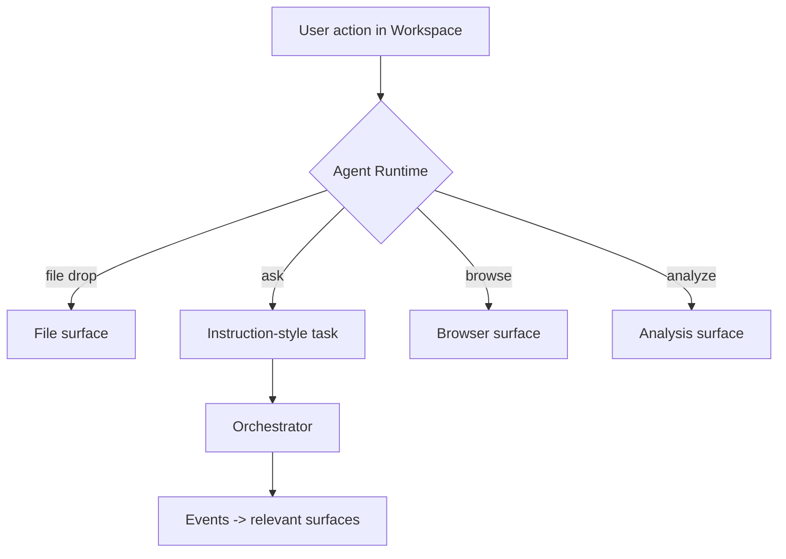

# 12 — Workspace Mode

Defines Workspace Mode separately. Source of truth: Phase 1 `10-ui-modes.md` and spec §3. No implementation. NOT a coding IDE, NOT a Codex clone.

## Principle
Workspace is a general interactive environment for working with the agent. It adapts to the task; it is not built around programming alone.

## Contextual surfaces (panels)
Surfaces appear based on task relevance — not all at once.

| Surface | Shows when relevant |
|---------|---------------------|
| Files | file-related task |
| Research | research/lookup task |
| Results | produced outputs |
| Artifacts | generated documents/code |
| Analysis | analysis task |
| Tools | tool usage |
| Agent activity | any agent running |
| Sub-agent activity | delegated sub-agents |
| Browser work | web/browser task |
| Task state | active/long task |
| Generated outputs | any produced artifact |

## Adaptation model

## Interaction
- The user interacts with surfaces (open a file, run research, inspect a result).
- Any surface action that requires agent work produces a Task/Action for the **same Agent Runtime** (no separate engine).
- Surfaces subscribe to events (09) and render only UI-visible state.

## Boundaries
- Workspace must not become a code-only IDE: non-code surfaces (research, analysis, results) are first-class.
- The same backend/Orchestrator serves both modes; only the UX layer differs (01-system-architecture.md).
