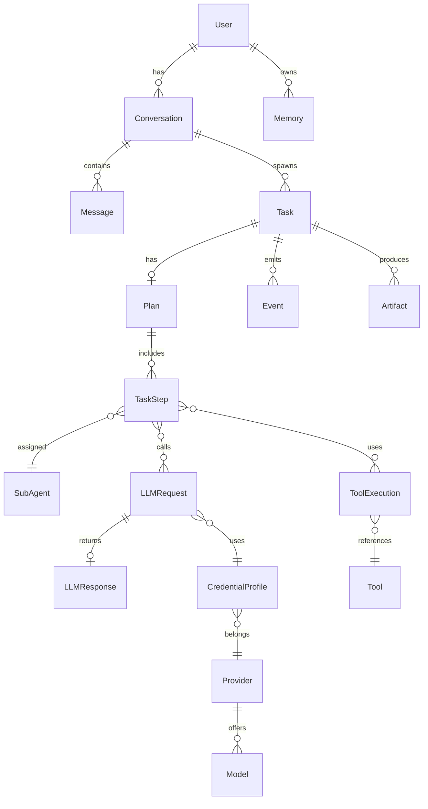

# 14 — Data and Persistence

Defines the data architecture. Source of truth: Phase 1 `12-data-architecture.md` and spec §18. No migrations, no models implemented.

## Stores (locked)
- **PostgreSQL:** durable relational state.
- **Redis:** cache, queues, live session/task state, rate limiting.
- **pgvector:** optional semantic memory, only when needed (08).

## Conceptual entities and relationships

## Entity notes
- **User, Conversation, Message:** session/UX state.
- **Task, Plan, TaskStep:** planning + execution state (mirrors 04, 09).
- **AgentExecution, ToolExecution, LLMRequest, LLMResponse:** observability + recovery records.
- **Provider, Model, CredentialProfile, UsageRecord:** LLM Gateway configuration + usage (07).
- **Memory, Artifact, Event:** persistent memory, produced outputs, realtime events (08, 09).

## Relationships
- Task belongs to Conversation; Steps belong to Plan; Steps reference Sub-Agents/Tools/LLMRequests.
- CredentialProfile maps to Provider/Model; UsageRecord rolls up per profile.
- Memory owned by User; Artifact produced by Task; Event emitted by Task.

## Constraints
- No new datastore beyond these three (Phase 1 §20.3).
- Secrets (CredentialProfile keys) stored encrypted; never in logs (15, 16).
