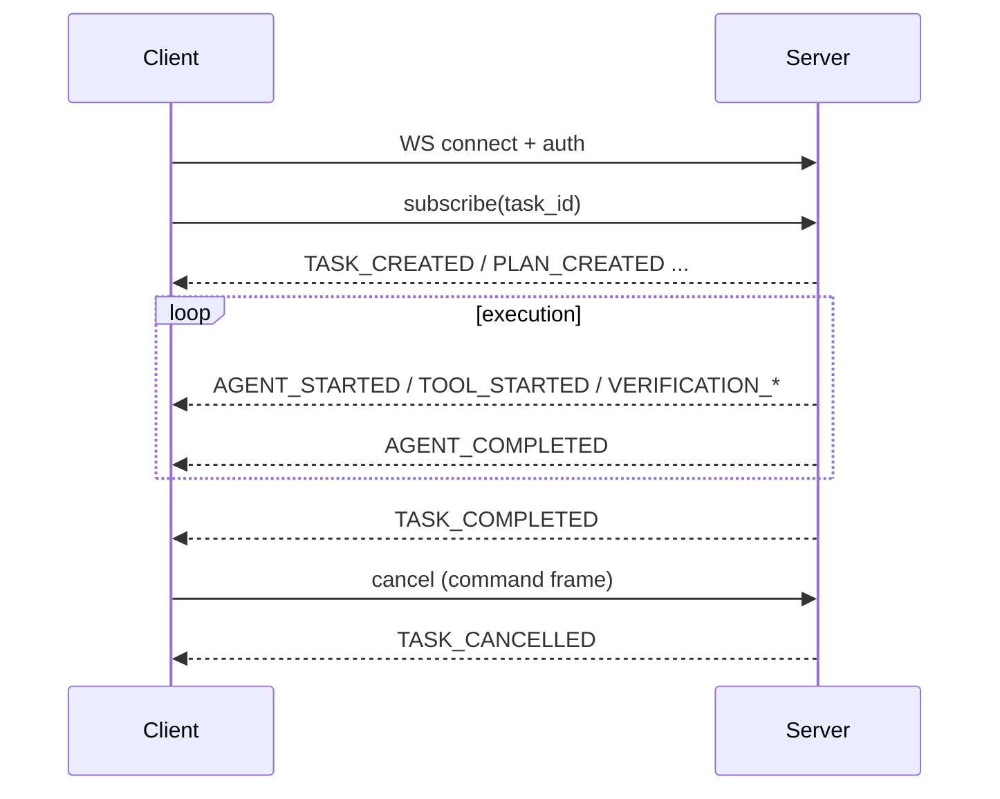

# Decision 01 — Realtime Architecture

## Selected architecture: HYBRID
- **Primary transport: WebSocket** — one authenticated, full-duplex connection per client session. Carries server→client events AND client→server command frames (cancel, approve, retry, subscribe).
- **Secondary transport: SSE** — read-only event stream for observer clients (e.g., external dashboards, read-only mirrors) that never issue commands. Uses the identical event vocabulary from `09-task-state-and-events.md`.

## Why selected
- Requirements include streaming model responses, progress, agent/tool/verification/recovery events, workspace activity, **cancellation**, **reconnect**, and long-running tasks.
- WebSocket natively supports bidirectional low-latency + cancellation on one connection (no extra REST round-trips).
- SSE is simpler and auto-reconnects for pure observers, but cannot send commands on the same connection; offering it as secondary avoids forcing a full WebSocket stack on read-only consumers.
- Single event vocabulary keeps both transports interchangeable.

## Client/server responsibilities
- **Server:** authenticates connection; streams events from Task State; accepts command frames; enforces authorization on commands; persists an ordered event log per task.
- **Client:** opens connection; subscribes to `conversation_id`/`task_id`; renders UI-visible state; sends command frames; handles reconnect/replay.

## Event flow (WebSocket primary)

## Event categories (from 09)
TASK_CREATED, PLAN_CREATED, AGENT_STARTED/COMPLETED, TOOL_STARTED/COMPLETED, LLM_STARTED/COMPLETED, VERIFICATION_STARTED/COMPLETED, RETRY_STARTED, REPLAN_STARTED, TASK_COMPLETED/FAILED/CANCELLED.

## Connection lifecycle
1. Connect + authenticate (15-security-and-permissions.md).
2. Subscribe to scope(s).
3. Receive streamed events (ordered by `seq`).
4. Close on logout / idle timeout.

## Reconnect behavior
- Client reopens WS and sends `last_seq` it processed.
- Server replays missed events from the persisted ordered event log (idempotent; Task State is source of truth).
- Task continues server-side even if connection dropped; no work is lost.

## Ordering expectations
- Per-task monotonic `seq`. Client tolerates rare out-of-order delivery and reorders by `seq`.
- Cross-task ordering not guaranteed (independent).

## Failure handling
- WS drop → client reconnects with `last_seq` (replay). Server-side task unaffected.
- Auth failure → connection refused. Unauthorized subscribe → error frame.

## Cancellation
- Client sends `cancel` command frame → API authorizes → Orchestrator transitions task to CANCELLED (02-agent-runtime.md). No partial unsafe side effects after cancel is honored.

## Compatibility
- **Instruction Mode (11):** full progress/plan/agent/tool/verification visibility + cancel/retry via WebSocket.
- **Workspace Mode (12):** surfaces subscribe to the same events; observer panels may use SSE.

## Future extensibility
- New event types added to vocabulary (09) flow to both transports automatically.
- A second observer can attach via SSE without consuming WebSocket capacity.

## Tradeoffs
- WebSocket: slightly heavier server (connection state) but unified command+event path.
- SSE: no command path; observer-only. Two transports to maintain, but both share one event serializer.
