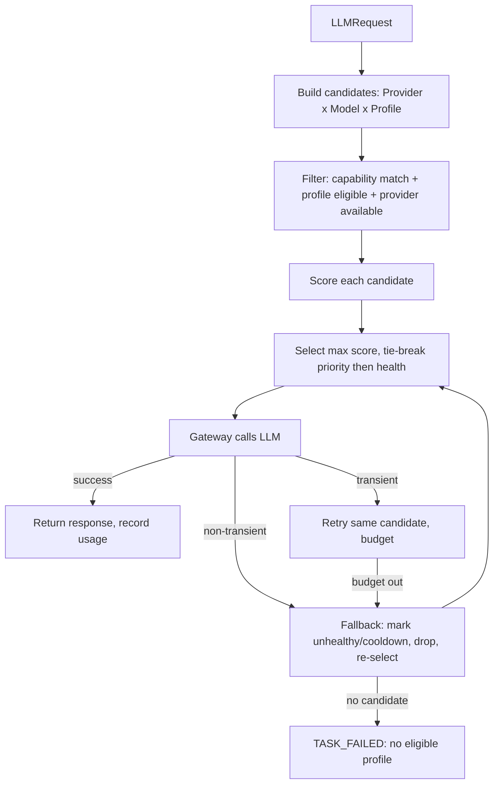

# Decision 02 — LLM Gateway / Router

## Selected architecture: WEIGHTED CANDIDATE SCORING
The Router builds candidate tuples `(Provider, Model, CredentialProfile)`, scores each against the request and live state, selects the highest-scoring eligible candidate, and falls back on failure/exhaustion. Selection is **deterministic given state + weights** (reproducible) and **adaptive** via live health/quota.

## Routing inputs
- `capability_requirement` (from Step)
- optional `model_requirement` (capability-level preference set by Orchestrator/user)
- live: provider availability/health, profile quota remaining, rate-limit state, priority, cost, expected latency
- policy flags: `prefer_free` (use legitimately-free quota while available)

## Decision process


## Scoring model
```
score = w_cap * capability_fit
      + w_pri * profile.priority
      + w_hlth * provider.health
      + w_qta * profile.quota_remaining_ratio
      + w_free * (prefer_free ? 1 : 0)        # bonus while free quota remains
      - w_cost * normalized_cost
      - w_lat * normalized_expected_latency
```
Weights are operator-configured constants. `capability_fit` = 1 if Model.capabilities ⊇ requirement else excluded at filter stage.

## Selection axes (independent)
- **Model selection:** by capability match to requirement (not vendor).
- **Provider/Credential selection:** by eligibility + score (priority, health, quota, free-quota preference, cost, latency).
The two axes are combined in the candidate tuple; either can dominate per weights.

## Fallback rules
- On non-transient failure or quota exhaustion of the chosen profile/provider: mark it unhealthy, start **cooldown** (T seconds), remove from candidate set, re-select next best.
- Task context is preserved because it lives in **Task State**, not in the call — the Orchestrator retries the same Step with a new candidate; nothing is lost.

## Retry rules
- **Transient** errors (timeout, HTTP 429 with retry-after, network blip): retry same candidate within `retry_budget`; increments attempt; switches to fallback only when budget exhausted.

## Cooldown behavior
- Unhealthy provider/profile enters cooldown; health recovers on a later successful call (or after cooldown elapses and a probe succeeds).

## Quota exhaustion behavior
- Profile marked exhausted → ineligible until quota resets. If **all** profiles exhausted → `TASK_FAILED` with explicit reason. **No bypass, no fake identity, no rate-limit circumvention** (spec §10, 07).

## Capability mismatch behavior
- If no candidate satisfies `capability_requirement` → fail fast with reason (do not degrade silently to an incapable model).

## Task continuation
- One model/account unavailable → next eligible continues automatically; Task State + Memory provide the logical context, so provider-agnostic continuity holds (decision 05).

## Deterministic vs adaptive
- Deterministic: same inputs + same live state + same weights → same selection (auditable).
- Adaptive: live health/quota/cooldown update the state between calls.

## Observability
- Every decision logged: selected (provider, model, profile), score, filter rejects, fallback reason, retry count (16-observability-and-logging.md, 14-data-and-persistence.md UsageRecord).

## Tradeoffs
- Weighted scoring is simple, explainable, and tunable without a complex ML router.
- Requires live state (health/quota) tracking in the Gateway — already in scope per 07.
- Free-quota preference is a policy flag, not a bypass; operator configures legitimate profiles only.
