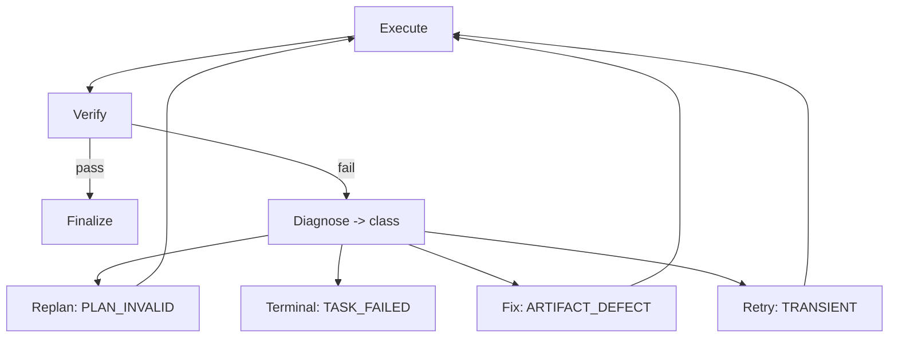

# Decision 03 — Verification System

## Selected architecture: PER-CATEGORY VERIFICATION
Verification method is chosen by the **output/task category**, not a generic "ask the LLM if it looks good". The Verifier (02-agent-runtime.md) executes the category method, collects evidence, and emits an accept/reject verdict. Reject feeds the diagnose→fix→verify loop (10-verification-and-recovery.md).

## Verification trigger
- After every Step whose `verification_requirement` is set (at PLAN_READY).
- Before task COMPLETE (aggregate of all steps).

## Per-category methods
| Category | Method | Evidence |
|----------|--------|----------|
| Text generation | Structured LLM-judge against `expected_output` criteria + constraint/fact check (judge ≠ generator) | judge verdict + cited criteria |
| Code changes | Static checks (lint/type via tools) + tests (pytest) + diff review; optional intent LLM-judge | test pass, lint/type clean, diff |
| Structured data | Schema validation vs `output_schema` + range/constraint assertions | validation report |
| Research | Source-citation check + claim-against-source verification + coverage vs query | citations, uncovered claims |
| File operations | Post-condition checks: file exists, correct path, permissions, content marker | fs check result |
| Tool execution | `output_schema` validation + side-effect post-condition where checkable + tool success | normalized result + assertion |
| Multi-step task | Step-wise verification aggregation + final goal-satisfaction check | per-step verdicts + goal check |
| External actions | Confirmation of external effect (receipt/id) + user-visible proof | receipt/confirmation |
| Workspace artifacts | Type/schema check + user-acceptance gate where required | artifact schema + approval |

## Verifier responsibility
- Pick method by category, run it, gather **evidence**, return **verdict** (accept | diagnose with failure class).

## Success criteria
- Evidence satisfies the category method's checks AND the Step's `verification_requirement`.

## Failure criteria (failure classes, per 10)
- TRANSIENT (tool flake) → RETRY
- ARTIFACT_DEFECT (wrong/incomplete) → FIX
- PLAN_INVALID (approach wrong) → REPLAN
- TERMINAL (unrecoverable/policy block) → TASK_FAILED

## Correction loop

## Retry / Fix / Replan behavior
- As defined in 10-verification-and-recovery.md; bounded by budgets.

## Escalation
- Repeated failure beyond budgets → TASK_FAILED with reason + evidence retained for audit (16).

## Maximum verification cycles
- `max_verify_cycles` per step (operator config). Exceeding → terminal failure. No infinite loop.

## Final acceptance criteria
- All Steps verified-accepted AND aggregate goal-satisfaction check passes.

## Tradeoffs
- Per-category methods are precise and auditable but require a method registry (implemented Phase 3).
- LLM-judge for text/research is itself a model call (through Gateway, 02); judge is never the generator (separation of duties).
