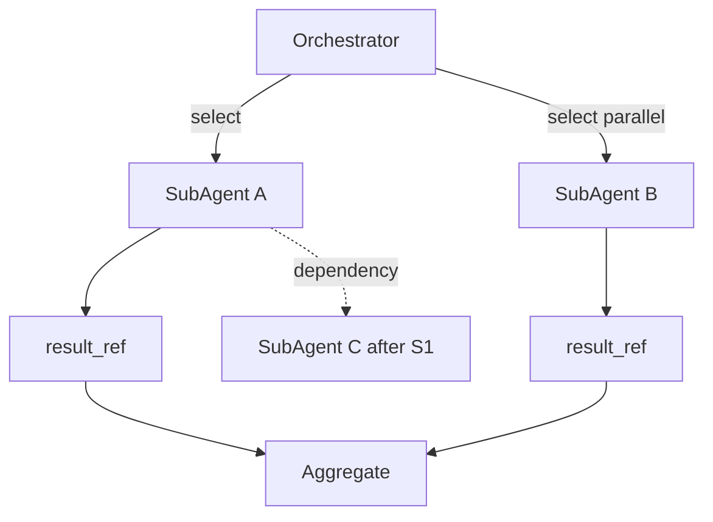

# Decision 04 — Runtime Sub-Agent Contracts

## Selected architecture: COMMON SubAgentContract + Orchestrator-selected execution
All 14 product runtime sub-agents share one contract. The Orchestrator selects, slices context, dispatches, aggregates, and recovers. The system is general-purpose (not coding-only).

## Common contract (SubAgentContract)
```
SubAgentContract {
  id, category
  responsibility
  selection_triggers[]      # when to select
  non_selection_triggers[]  # when NOT to select
  input_schema              # required input
  context_requirements      # what context slice needed
  allowed_tool_categories[] # tool categories permitted
  output_schema             # structured result
  status_reporting          # emits AGENT_STARTED/COMPLETED + internal spans
  failure_reporting         # typed error (TRANSIENT/DEFECT/INVALID/TERMINAL)
  verification_behavior     # self-check then hand to Verifier
  handoff                   # returns result_ref
}
```

## Per-sub-agent definition (all 14)
| Category | Select when | Do NOT select when | Allowed tools | Output |
|----------|-----------|-------------------|---------------|--------|
| Research | need external/lib info | info already in context | Web, Search | research brief + sources |
| Deep Reading | need comprehension of sources | shallow scan enough | Files, Web | understanding struct |
| Analysis | need trade-off/analysis | trivial | Files, Calculator | analysis + recommendation |
| Planning | need decomposition | already planned | Files | Plan draft |
| Coding | need implementation | non-code task | Code, Terminal, Files | code + notes |
| Writing | need docs/copy | code task | Files | document |
| Debug | failure to diagnose | no failure | Code, Terminal, LSP | root-cause |
| Fix | defect to correct | no defect | Code, Terminal, Files | patched change |
| Review | need review | no artifact | Files, Code | findings |
| Testing | need tests/run | no testable target | Terminal, Code | pass/fail |
| Browser | web/browser action | no web need | Browser, Web | extracted state |
| File | file locate/read/org | no file need | Files | context bundle |
| Verification | verify artifact | no artifact | Files, tool refs | verdict |
| Security/Permission | audit/sec check | no security scope | Files, Code | findings |

(User override of selection is allowed via `user_specified`, 03-orchestrator.md.)

## Required input / task context / available tools / expected output / status / failure / verification / handoff
- **Required input:** Step goal fragment + `input_schema` fields.
- **Task context:** relevant slice assembled by Memory Manager (08/05).
- **Available tools:** only `allowed_tool_categories`, mediated by Tool Manager (permission-checked, 06).
- **Expected output:** `output_schema` structured result.
- **Status reporting:** AGENT_STARTED/COMPLETED events + internal trace spans (16).
- **Failure reporting:** typed error; never silent partial success.
- **Verification behavior:** self-check output before return; final accept by Verifier (03).
- **Handoff:** returns `result_ref` written to Task State; Orchestrator aggregates.

## Interactions
- **Orchestrator:** only entity that invokes a sub-agent; owns lifecycle (02, 03).
- **Memory/Context:** reads context slice via Memory Manager; writes nothing except via result.
- **Task State:** result stored as `result_ref` (09).
- **LLM Gateway:** model access only via Gateway (07); never direct provider.

## Orchestrator selection
- Match Step role → category; apply user override; never select a category whose `non_selection_triggers` match.

## Multiple / parallel / sequential / dependency

- **Parallel:** independent steps' sub-agents run concurrently (04).
- **Sequential:** dependency edge forces order.
- **Dependency handling:** consumer reads producer's `result_ref`.
- **Handoff:** structured result passed via Task State.
- **Conflict handling:** if two sub-agents conflict, Orchestrator uses Verifier/Analysis to reconcile or REPLAN.
- **Failure recovery:** typed error → retry/fix/replan per 10.

## General-purpose guarantee
Categories span research/writing/analysis/security/etc.; coding is one of fourteen, not the whole system. Workspace Mode (12) uses non-code categories as first-class.

## Tradeoffs
- One contract simplifies the runtime and Tool Manager; per-category method tables live in config (Phase 3).
- Strict context slicing avoids context overflow and leakage between sub-agents.
